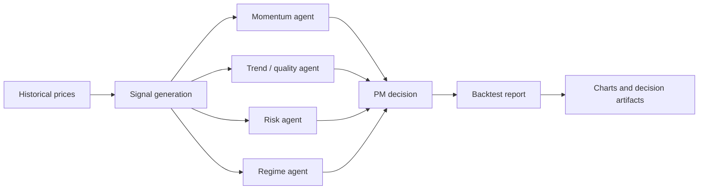

# Multi-Agent Trading System - System Brief

## Problem

Trading research is easy to overfit when backtests hide assumptions. This project treats strategy development as an auditable research system with agent decisions, costs, benchmark comparison, drawdown analysis, failure regimes, and retained reports.

## System Design



## Stack

- Python, pandas, NumPy
- Multi-agent decision workflow
- Historical backtesting with transaction costs
- Charts, reports, and decision artifacts under `reports/`

## Metrics

- Simulation window: `2012-2026`
- Universe: `100` US large-cap stocks
- QMB result: `+19.8%` CAGR, `0.95` Sharpe, `-28%` max drawdown
- `722` trades under stated assumptions
- Transaction assumptions: `0.05%` slippage plus `$0.005/share` commission

## Run

```bash
make setup
make test
```

Charts: https://github.com/srn91/multi-agent-trading-system/tree/main/reports/charts

## Research Controls And Limitations

- Results are historical simulations, not guarantees of future performance.
- Transaction costs and slippage are included, but real liquidity, borrow, and market impact can differ.
- Walk-forward validation is partially implemented and should be extended before any production use.
- Survivorship bias and regime overfit should be reviewed with a broader point-in-time universe.
- Failure regimes, turnover, benchmark comparison, and drawdown behavior should remain visible in future reports.
